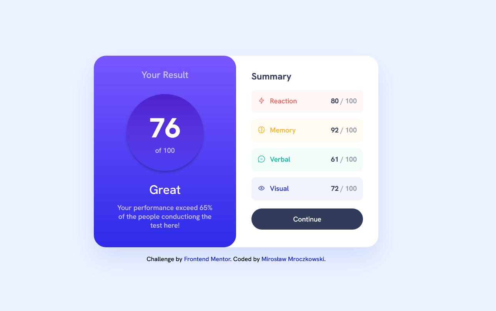
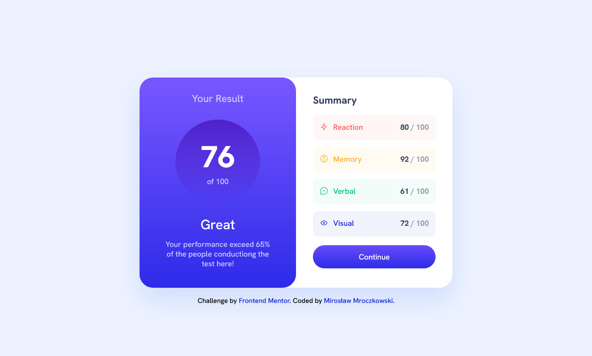
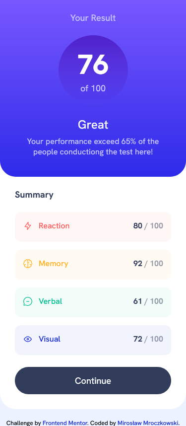

# Frontend Mentor - Results summary component

This is a solution to the
[Results summary component challenge on Frontend Mentor](https://www.frontendmentor.io/challenges/results-summary-component-CE_K6s0maV).
Frontend Mentor challenges help you improve your coding skills by building realistic projects.

## Table of contents

- [Overview](#overview)
  - [The challenge](#the-challenge)
  - [Screenshot](#screenshot)
  - [Links](#links)
- [My process](#my-process)
  - [Built with](#built-with)
- [Author](#author)
- [Acknowledgments](#acknowledgments)

## Overview

### The challenge

Users should be able to:

- View the optimal layout for the interface depending on their device's screen size
- See hover and focus states for all interactive elements on the page

### Screenshot

  

### Links

- Solution URL: [Results summary component](https://github.com/FrontEndMentor-MyChallanges/results-summary-compnent)
- Live Site URL: [Results summary component](https://frontendmentor-mychallanges.github.io/results-summary-compnent/)

## My process

### Built with

- Semantic HTML5 markup
- SCSS
- Flexbox
- JS

## Author

- Frontend Mentor - [@miroslaw-mroczkowski](https://www.frontendmentor.io/profile/miroslaw-mroczkowski)
